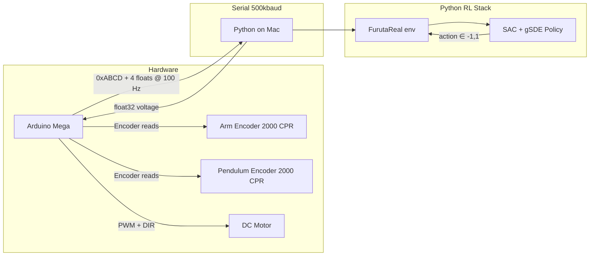

# Furuta Pendulum Swing-Up — Project Walkthrough

## What Is This?

This is a **sim-to-real reinforcement learning project** for a [Furuta (rotary inverted) pendulum](https://en.wikipedia.org/wiki/Furuta_pendulum). The goal: train an RL agent (SAC + gSDE) to **swing the pendulum from hanging → upright** and balance it there, first in simulation, then fine-tune on real hardware.

> [!IMPORTANT]
> This is a 6th semester EDL (Engineering Design Lab) college project — real physical hardware controlled by a neural network in real-time.

---

## System Architecture



---

## File Map

| File | Purpose |
|------|---------|
| [config.py](file:///Users/nihar/Downloads/College/6th%20Sem/EDL/python_files/new_files/swing-up/config.py) | Physical constants (masses, lengths, inertias, motor params) and constraints (12V, dt=0.01s, 2500 max steps) |
| [furuta_utils.py](file:///Users/nihar/Downloads/College/6th%20Sem/EDL/python_files/new_files/swing-up/furuta_utils.py) | State index labels (`ALPHA`=arm, `THETA`=pendulum), velocity filter, timing |
| [qube_dynamics.py](file:///Users/nihar/Downloads/College/6th%20Sem/EDL/python_files/new_files/swing-up/qube_dynamics.py) | Equations of motion (Euler-Lagrange) with domain randomization support |
| [furuta_env.py](file:///Users/nihar/Downloads/College/6th%20Sem/EDL/python_files/new_files/swing-up/furuta_env.py) | Gymnasium env for **simulation** (`FurutaSim`) — physics stepping, reward, obs |
| [furuta_real.py](file:///Users/nihar/Downloads/College/6th%20Sem/EDL/python_files/new_files/swing-up/furuta_real.py) | Gymnasium env for **real hardware** (`FurutaReal`) — serial comms with Arduino |
| [train.py](file:///Users/nihar/Downloads/College/6th%20Sem/EDL/python_files/new_files/swing-up/train.py) | SAC+gSDE training in **simulation** |
| [train_real.py](file:///Users/nihar/Downloads/College/6th%20Sem/EDL/python_files/new_files/swing-up/train_real.py) | SAC fine-tuning on **real hardware** with auto-resume from checkpoints |
| [bootstrap_from_csv.py](file:///Users/nihar/Downloads/College/6th%20Sem/EDL/python_files/new_files/swing-up/bootstrap_from_csv.py) | Pre-fill replay buffer from classical controller CSV data |
| [eval.py](file:///Users/nihar/Downloads/College/6th%20Sem/EDL/python_files/new_files/swing-up/eval.py) | Evaluate trained policy in simulation |
| [eval_real.py](file:///Users/nihar/Downloads/College/6th%20Sem/EDL/python_files/new_files/swing-up/eval_real.py) | Evaluate trained policy on real hardware (no learning, pure inference) |
| [simulate.py](file:///Users/nihar/Downloads/College/6th%20Sem/EDL/python_files/new_files/swing-up/simulate.py) | 2D live animation (arm top-down + pendulum side view) |
| [visualize.py](file:///Users/nihar/Downloads/College/6th%20Sem/EDL/python_files/new_files/swing-up/visualize.py) | 3D live visualization with live plots (angle, voltage history) |
| [probe_hardware.py](file:///Users/nihar/Downloads/College/6th%20Sem/EDL/python_files/new_files/swing-up/probe_hardware.py) | Debug tool — passive 0V read from Arduino to verify encoder conventions |
| [arduino_firmware.ino](file:///Users/nihar/Downloads/College/6th%20Sem/EDL/python_files/new_files/swing-up/arduino_firmware/arduino_firmware.ino) | Arduino Mega firmware — encoder reading, velocity filtering, motor PWM, serial protocol |

---

## Conventions

| Symbol | Meaning | Zero position |
|--------|---------|---------------|
| **θ** (THETA) | Pendulum angle | **0 = UPRIGHT** (unstable equilibrium) |
| **α** (ALPHA) | Arm angle | 0 = boot position |
| State vector | `[α, θ, α̇, θ̇]` | — |
| Observation (6D) | `[cos α, sin α, cos θ, sin θ, α̇, θ̇]` | Trig encoding avoids discontinuities |
| Action | Scalar in `[-1, 1]` | Scaled to `±max_voltage` (12V) |


---

## Physics / Dynamics

The equations of motion in [qube_dynamics.py](file:///Users/nihar/Downloads/College/6th%20Sem/EDL/python_files/new_files/swing-up/qube_dynamics.py) implement the **Euler-Lagrange formulation** for a rotary inverted pendulum:

- **Motor model**: `τ = kt(V - km·α̇) / Rm` with stall torque clamping
- **Mass matrix** `M`, **Coriolis** `C`, **gravity** `G` → solve `M·q̈ = τ - C - G - D·q̇`
- **Domain randomization**: every episode reset calls `dyn.randomize()` which perturbs all physical parameters by their `_std` (currently all 0, but ready to use)
- Integration: Euler method at 500 Hz substeps within each 100 Hz control step

---

## Reward Function

The primary reward used is **`exp_alpha_2`**:

```
r = exp_pendulum_reward(state, exp=2) × arm_reward(state)
```

- **`exp_pendulum_reward`**: Exponentially shaped — peaks at θ=0 (upright), zero at θ=±π (hanging). The `exp` parameter controls sharpness.
- **`arm_reward`**: Soft penalty for large arm angles — discourages spinning the arm wildly.
- Combined: reward is maximum **only** when pendulum is upright AND arm is near center.

---

## Training Pipeline

### Phase 1: Simulation Training ([train.py](file:///Users/nihar/Downloads/College/6th%20Sem/EDL/python_files/new_files/swing-up/train.py))

```
python bootstrap_from_csv.py --csv classical_data_real.csv --out buffer.pkl
python train.py --total_timesteps 300000 --replay_buffer buffer.pkl
```

- **Algorithm**: SAC (Soft Actor-Critic) with **gSDE** (generalized State-Dependent Exploration) — better than Gaussian noise for continuous control
- **Key hyperparams**: lr=3e-4, buffer=1M, batch=256, γ=0.99, τ=0.005, sde_sample_freq=64
- **Wide initial state**: pendulum starts at random angle ∈ [-π, π] so agent sees all configurations
- **Termination**: speed limits (60 rad/s arm, 400 rad/s pendulum), arm angle limit (±90°), or full pendulum revolution (wire safety)
- **Bootstrap**: Optional pre-fill of replay buffer from classical controller data (CSV from prior experiments)
- **Eval**: Every 10k steps, 5 deterministic rollouts; best model saved

### Phase 2: Hardware Fine-Tuning ([train_real.py](file:///Users/nihar/Downloads/College/6th%20Sem/EDL/python_files/new_files/swing-up/train_real.py))

```
python train_real.py --port /dev/cu.usbmodem1401 \
    --model runs/sac_gsde/best/best_model.zip \
    --replay_buffer runs/sac_gsde/buffer.pkl \
    --ent_coef 0.05
```

- Loads sim-trained policy as starting point
- **Auto-resume**: finds latest `sac_real_*_steps.zip` checkpoint on restart
- **Checkpoints** every 2000 steps (model + replay buffer)
- **Action smoothing**: EMA with α=0.3 to prevent voltage spikes on real motor
- **Arm recentering at reset**: gently pushes arm back toward 0° before waiting for pendulum to settle hanging
- **Gradient steps = 1** (conservative for hardware safety)
- **Fixed entropy** (`ent_coef=0.05`) — auto-tuning disabled because checkpoint compatibility issues
- Runs indefinitely until Ctrl+C

---

## Arduino Firmware

The [firmware](file:///Users/nihar/Downloads/College/6th%20Sem/EDL/python_files/new_files/swing-up/arduino_firmware/arduino_firmware.ino) runs on an **Arduino Mega** at **100 Hz**:

- **Encoders**: 2000 CPR quadrature encoders on arm and pendulum, read via hardware interrupts
- **Velocity**: finite difference + 0.25/0.75 exponential smoothing filter
- **TX** (to Python): `0xABCD` sync word + 16 bytes `{θ_pend, θ_arm, ω_pend, ω_arm}` as float32s
- **RX** (from Python): 4-byte float32 voltage command
- **Safety**: motor cuts off if no command received for 100ms (watchdog)
- **Deadzone compensation**: voltages below 0.5V are zeroed (motor friction threshold)
- **No safety cutoff on pendulum angle** — full swing-through allowed for swing-up training

---

## Training Runs History

| Directory | Description |
|-----------|-------------|
| `sac_gsde` | Base simulation training (90° arm limit) |
| `sac_gsde_9v` | Sim training with reduced 9V ceiling |
| `sac_gsde_135` | Sim training with 135° arm limit |
| `sac_gsde_150_soft` | **Currently running** — 150° soft arm bound |
| `sac_real` | First hardware fine-tuning run |
| `sac_real_135` | Hardware run with 135° arm limit |
| `sac_real_broken` | Failed hardware run |
| `sac_real_150_collapsed_swing_up_once` | Hardware run that achieved swing-up once then collapsed |

---

## Current State

You are currently running `train_real.py` fine-tuning on hardware, resuming from checkpoint at **151,687 steps**. The run is logging to `runs/sac_gsde_150_soft/SAC_3`. Key active settings:
- **ent_coef = 0.05** (fixed, no auto-tuning)
- **gradient_steps = 1**
- **Target: 10M steps** (~33h at 80 fps)
- Metrics look healthy: critic_loss=0.485, actor_loss=-33.3, std=0.267
